# 多商户入驻线下门店点餐平台

免责声明：本点餐平台借用益禾堂饮料仅作为图片演示系统功能，若侵权请联系微信号 **java_developer_1** 删除

多商户入驻线下门店点餐平台，可支持多商户注册入驻。基于SpringBoot、Vue.js 2.0、Spring Security JWT、Mybatis Plus、微信小程序ColorUI和Vant UI、MySQL 8.0。

该平台包含3个用户角色：超级管理员、商户、用户。

超级管理员：拥有web端的管理平台，主要管理商户。可对商户的开店资质进行审核。

商户：拥有web端的管理平台，主要管理店铺信息。包括商户账号注册、桌子管理、商品及其子属性管理、价格管理、订单管理。

用户：基于微信小程序。主要功能为扫码点餐、商品浏览、购物车、提交订单、获取取餐码、查看个人订单。

具体可查看下方图片：

## 超级管理员端

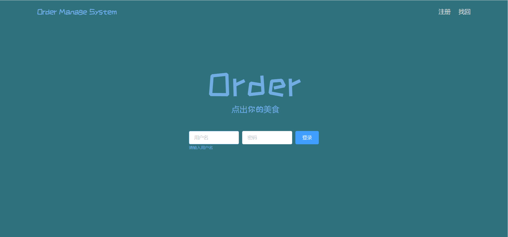
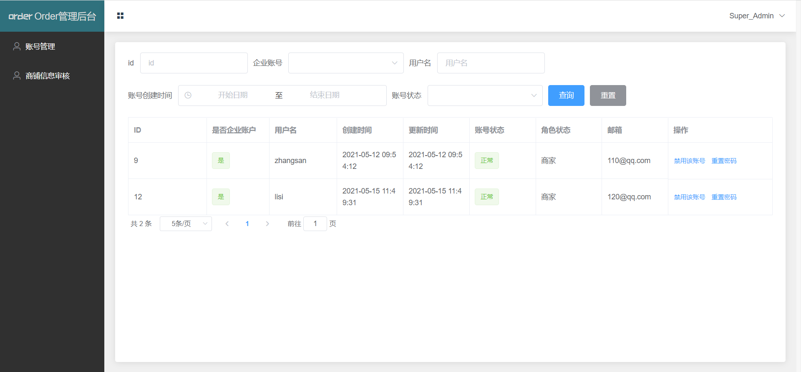
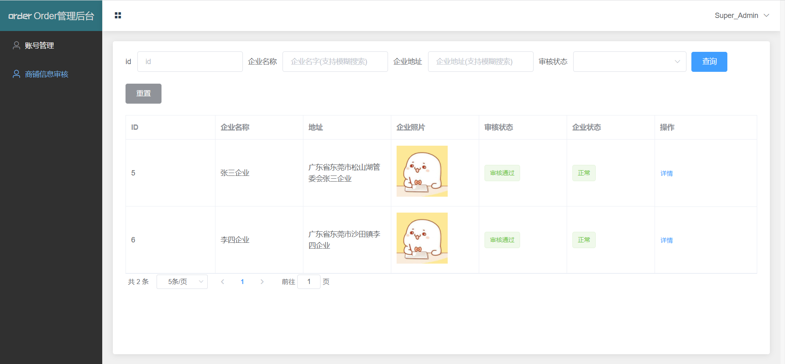

## 商户端
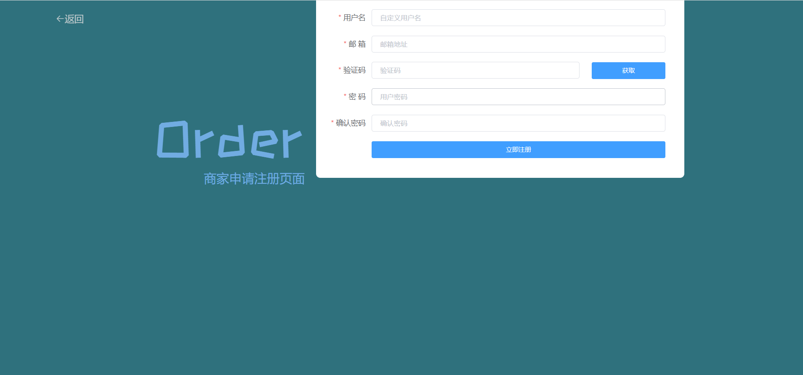
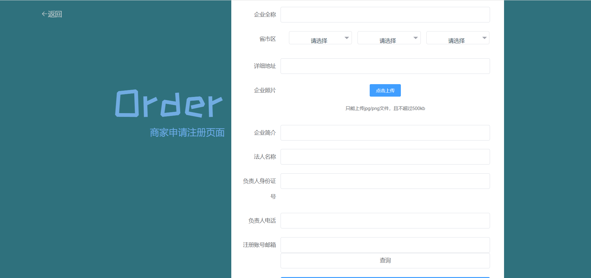
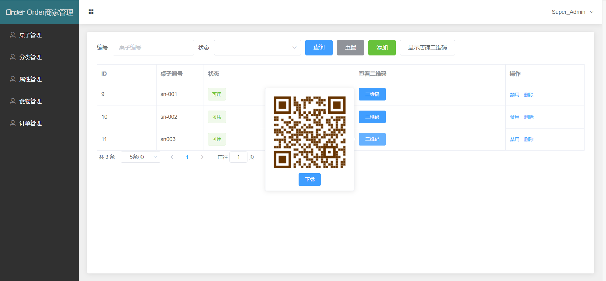
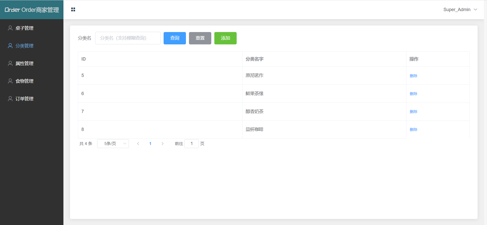
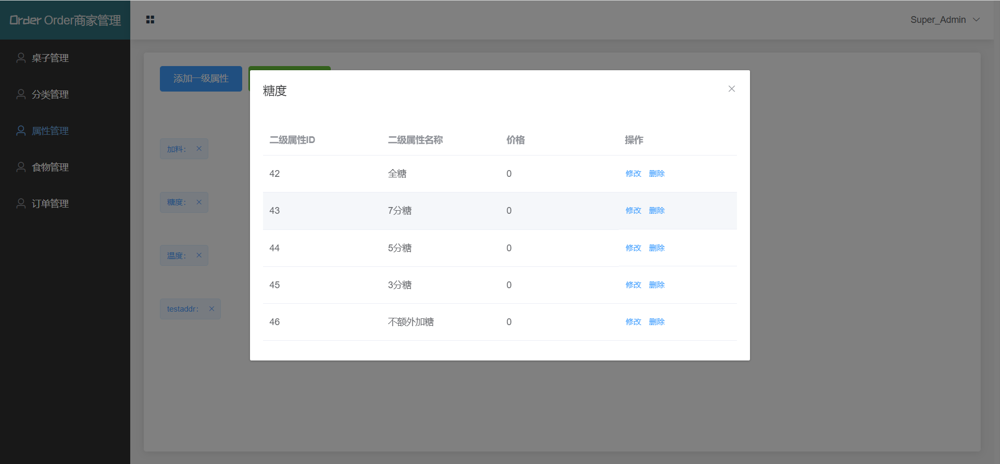
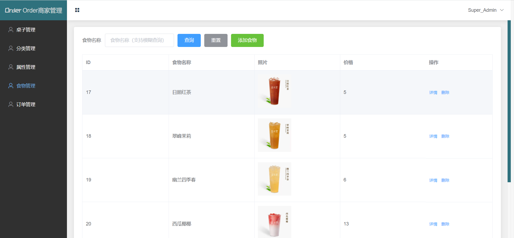
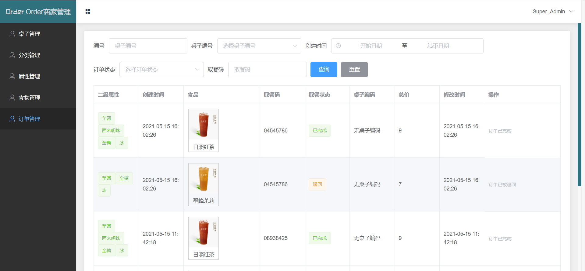

## 用户微信小程序端

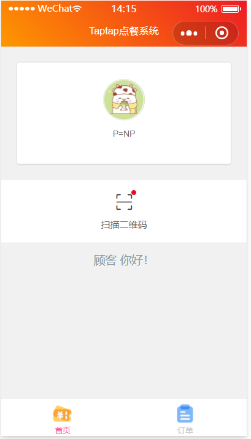
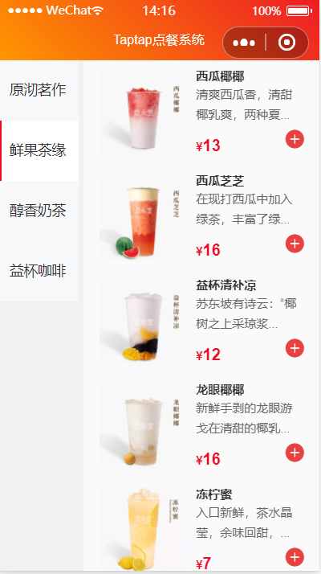
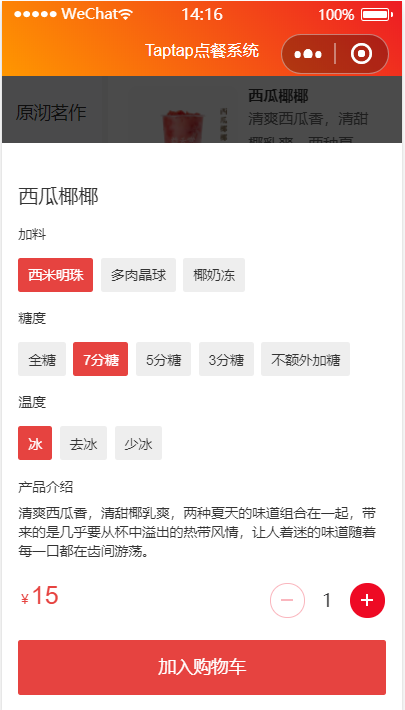
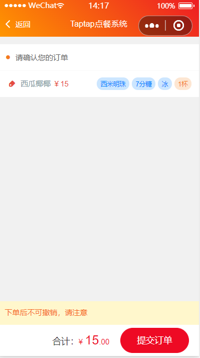
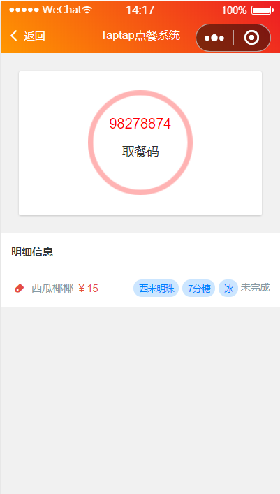

源码+数据库文件价格：￥199

源码+数据库+部署价格：￥299

源码+数据库+部署+项目答疑价格：￥329

  

请联系微信号：**java_developer_1**

